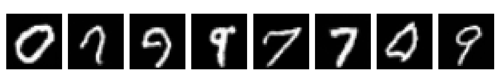
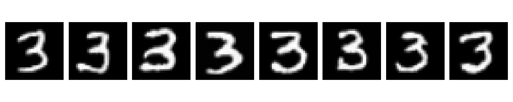

# 🧠 Classifier-Guided Image Generation with DDPM (MNIST)

This project showcases an end-to-end pipeline for generating MNIST digits using a Denoising Diffusion Probabilistic Model (DDPM) with classifier guidance. Built using PyTorch and Hugging Face's `diffusers`.

---

## 🔍 Project Overview

This project follows a **3-step process**:

### 1. 🧑‍🏫 Train a Classifier on Noisy Data
A CNN classifier is trained to correctly classify MNIST digits after Gaussian noise has been added, following the DDPM noise schedule. This classifier will be used to guide the generative model.

### 2. 🌀 Train an Unconditional DDPM Model
A U-Net-based denoising model is trained to reverse the noise process applied to MNIST images. This is a standard unconditional DDPM that learns how to denoise images from pure Gaussian noise.

### 3. 🎯 Perform Classifier-Guided Inference
During sampling, the classifier's gradients are used to guide the diffusion process toward generating a specific target class (e.g., digit “1”).

---

## 🏗️ Project Structure

```
.
├── classifier.py               # CNN classifier definition
├── train_classifier.py        # Classifier training on noisy data
├── train_ddpm.py              # Unconditional DDPM training
├── inference.py               # Classifier-guided sampling
├── quick_demo_CGD.ipynb                 # Quick notebook-based demo
├── models/                    # Directory for saving weights
│   ├── classifier.pth
│   └── ddpm_unet.pth
├── sample_ddpm_output.png     # Sample outputs from DDPM
├── guided_output.png          # Classifier-guided samples
├── requirements.txt
└── README.md
```

---

## 🚀 Getting Started

### 1. Install Dependencies

```bash
pip install -r requirements.txt
```

### 2. Train the Classifier

```bash
python train_classifier.py
```

### 3. Train the DDPM Model

```bash
python train_ddpm.py
```

### 4. Generate Classifier-Guided Samples

```bash
python inference.py
```

Or, explore everything interactively using:

```bash
jupyter notebook quick_demo_CGD.ipynb
```

---

## 🧠 Theoretical Background

### ✳️ Denoising Diffusion Probabilistic Models (DDPM)
DDPMs are a class of generative models that learn to reverse a gradual Gaussian noising process. The model is trained to predict the noise added at each step, enabling generation by denoising a sample of pure noise step-by-step.

### 🎯 Classifier Guidance
Instead of conditioning the model on labels during training, we use a separately trained classifier to guide the sampling process. Gradients of the classifier's prediction (w.r.t the input image) are used to nudge samples toward a target class during reverse diffusion.

This gives you:
- The flexibility of unconditional generation.
- The control of conditional generation.

---

## 🖼️ Results

### ✨ Unconditional DDPM Samples


### 🎯 Classifier-Guided Samples (Digit: 1)


---

## 📚 References

- [Denoising Diffusion Probabilistic Models (Ho et al., 2020)](https://arxiv.org/abs/2006.11239)
- [Classifier-Free Guidance (Nichol et al., 2021)](https://arxiv.org/abs/2107.00630)
- [Hugging Face Diffusers](https://github.com/huggingface/diffusers)

---

